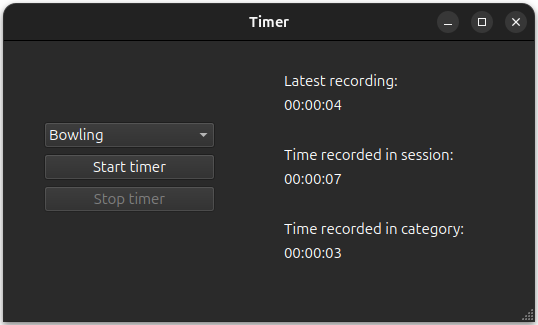

# Timer

A timer app where you can record into different user defined categories. All of the recordings are stored in a local database.

  <picture>
    <source media="(prefers-color-scheme: dark)" srcset="./timer_dark.png" width="80%">
    
  </picture>

## Features

- Support for user defined categories.
- Stores the records locally in an sql database.
- Shows elapsed time for the most reccent recording.
- Shows how much has been recorded accross all categories since the app was opened.
- Shows how much has been recorded into the selected category overall.

## Installation with bash

To install, prepare a directory where you want the program  and cd into it, then run these commands in the terminal:

    git clone git@github.com:PiispaH/Timer.git
    cd Timer
    python3 -m venv .venv --prompt timer
    source .venv/bin/activate
    python3 -m pip install -r requirements.txt

After installation, the program runs with the command (in the repository root with the virtual environment active):

    python3 -m timer
